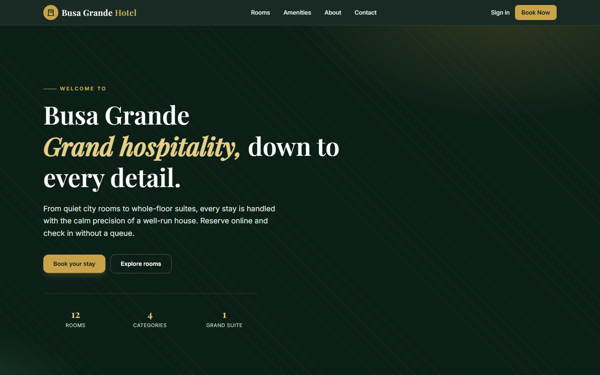
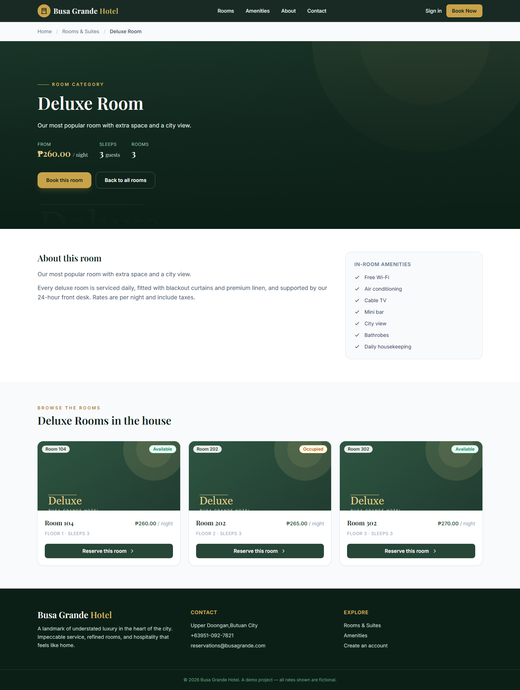
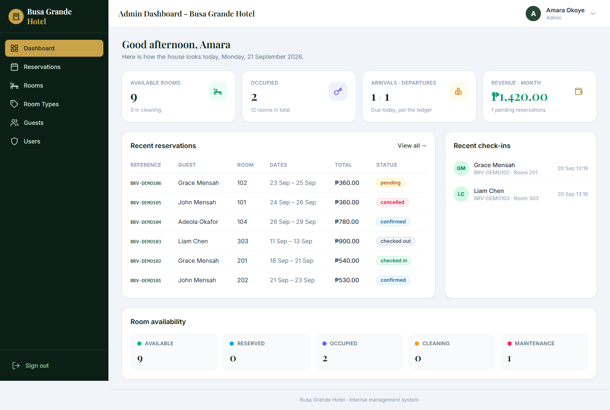
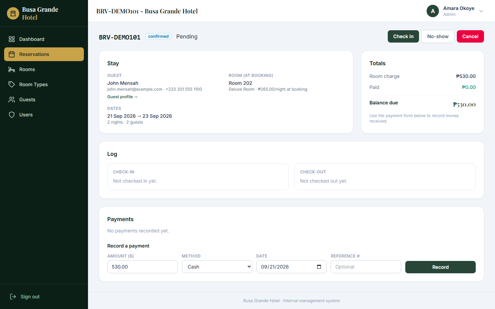
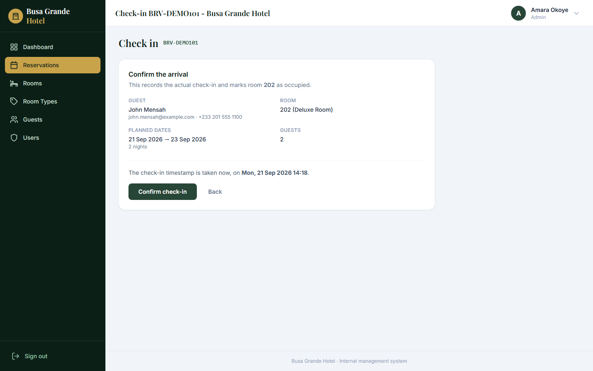
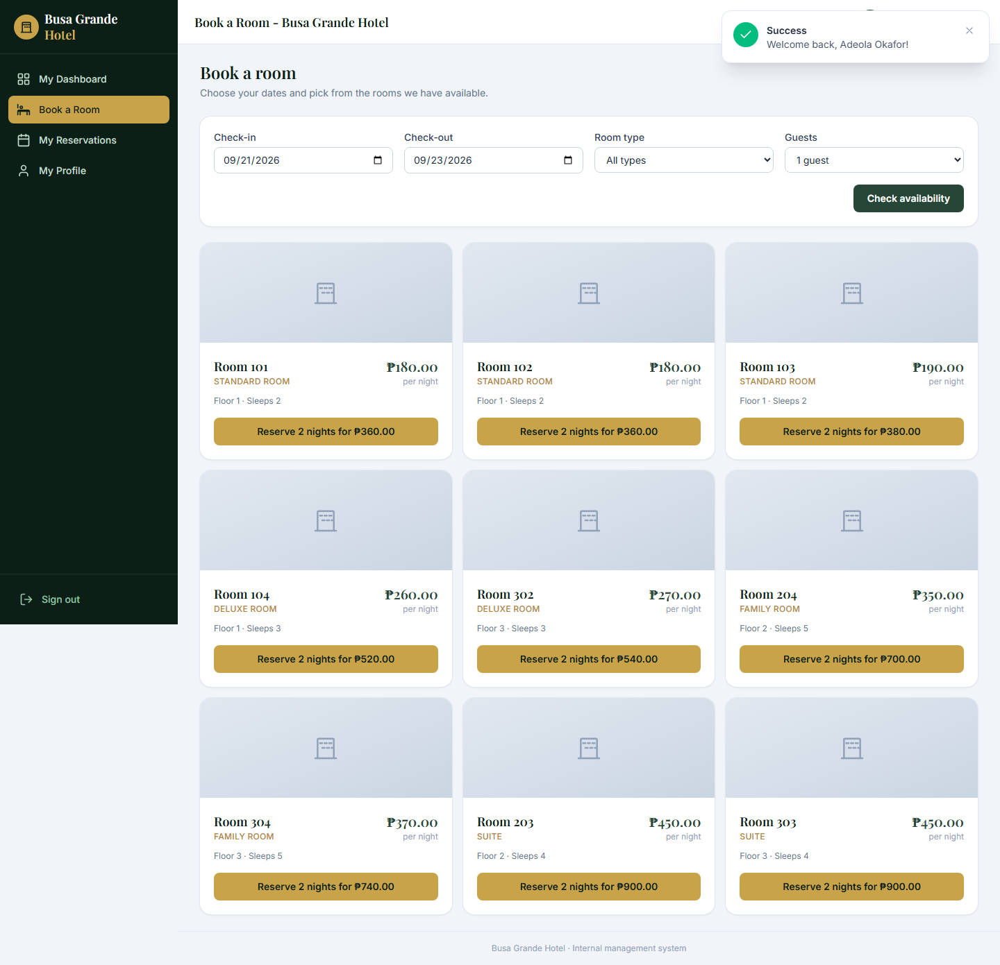

# Busa Grande Hotel

A hotel management system written in plain PHP. No Laravel, no framework, no ORM. Just PHP 8, MySQL, and a small MVC kernel I wrote myself.



## Why I built it

I'd used Laravel for a while and could ship features with it, but I couldn't honestly explain what happened between a request arriving and a controller running. That bothered me. So I gave myself one rule for this project: build a real application, and write the framework parts myself.

The result is a working hotel system: a public site, guest self-service booking, and the full front-desk flow (reservations, check-in, check-out, payments) behind three roles. The folder layout deliberately mirrors Laravel's (`app/`, `routes/`, `views/`, `config/`) because that shape is familiar and easy to navigate. But there's no framework package installed. Everything in `app/Core` (the router, request handling, session, CSRF, view renderer, validator and database layer) is hand-written, which is the whole point of the exercise.

The front-end is Tailwind CSS v4 with a bit of jQuery for the AJAX room and guest pickers. Composer pulls in exactly two things: `vlucas/phpdotenv` for `.env` handling, and PHPUnit for tests.

## What's in it

**Public site.** A marketing homepage and a room-type page where you can browse the actual rooms in each category, with photos, capacity, floor, amenities and nightly rate. Photos can be uploaded per room or per room type from the admin side. If none is set, the page falls back to a generated placeholder.



**Front desk.** A dashboard with today's occupancy, arrivals and departures, plus the full reservation lifecycle. Staff can take a booking (with a live availability check), check a guest in, record payments, and check them out.







**Guest area.** Guests register or sign in, pick dates, choose from the rooms that are actually free, and manage or cancel their own bookings. A guest can only ever see their own reservations; that's enforced in the queries, not just the UI.



**Roles.** There are three: `admin`, `staff` and `guest`. Middleware is declared per route in `routes/web.php` and enforced centrally by the router, so a new route can't accidentally skip the permission check.

## A few decisions worth explaining

**Availability uses a half-open interval.** Two stays conflict when `existing.check_in < new.check_out AND existing.check_out > new.check_in`. That means a guest checking out on the 8th frees the room for someone arriving on the 8th. The check runs on the server inside the reservation service. The JavaScript availability picker is a convenience, never the authority.

**Prices are snapshotted onto the reservation.** `room_price_snapshot`, `nights` and `total_amount` are stored at booking time. If the nightly rate changes later, existing bookings don't move. It also means a reservation is a record of what was actually agreed, which felt more correct than recalculating from current prices.

**CSRF is handled in one place.** The router rejects any non-GET request without a valid token before a controller is reached, so no route has to remember to check.

**The database layer uses real prepared statements** (`PDO::ATTR_EMULATE_PREPARES => false`). This bit me while building. With native MySQL prepares, a named placeholder can only be used once in a statement, and passing `execute([':q' => $value])` with the leading colon throws `HY093`. Two of my search queries reused `:q` for a multi-column `LIKE`, which worked fine while emulation was on and broke the moment it was off. I rewrote those as positional parameters and added a small `Database::execute()` helper so the binding rules live in one place instead of being rediscovered per query.

## Running it locally

You'll need PHP 8.1+ with `pdo_mysql`, MySQL 8, Composer, and Node (just for the Tailwind build).

```bash
composer install
npm install && npm run build

cp .env.example .env
# set DB_DATABASE / DB_USERNAME / DB_PASSWORD in .env

php scripts/migrate.php
php scripts/seed.php

php -S 127.0.0.1:8090 -t public public/router.php
```

Then open http://127.0.0.1:8090.

The seeder is idempotent, so it's safe to run more than once. It creates the roles, the three demo accounts, four room types, twelve rooms, and a handful of reservations in various states so the dashboard isn't empty on first load.

## Demo accounts

| Role  | Email                   | Password    |
|-------|-------------------------|-------------|
| Admin | `admin@busagrande.test` | `Admin123!` |
| Staff | `staff@busagrande.test` | `Staff123!` |
| Guest | `guest@busagrande.test` | `Guest123!` |

These are demo credentials for local use. Change them (and the database user) before putting this anywhere public.

## Tests

There's a PHPUnit suite covering the parts that are easy to get wrong: the availability overlap rule, the reservation service (pricing, validation, cancellation) and the check-in/check-out state transitions.

```bash
composer test
```

Tests run against a separate `<database>_test` database that gets dropped and rebuilt from the migrations on each run, so your development data is untouched.

## Things I'd add next

- Multiple photos per room, rather than one image field. This needs a `room_images` table.
- A proper date-range calendar on the room-type page instead of sending people to the booking form.
- Email confirmation on booking. Right now everything is in-app.
- Soft-deleting rooms and guests so history survives.

## Notes

This is a learning project that grew into something I'm happy with. The rates, the address and the reviews are all fictional. Google sign-in is wired up but disabled by default; it needs your own OAuth credentials in `.env` before the button appears.

Licensed under MIT.
